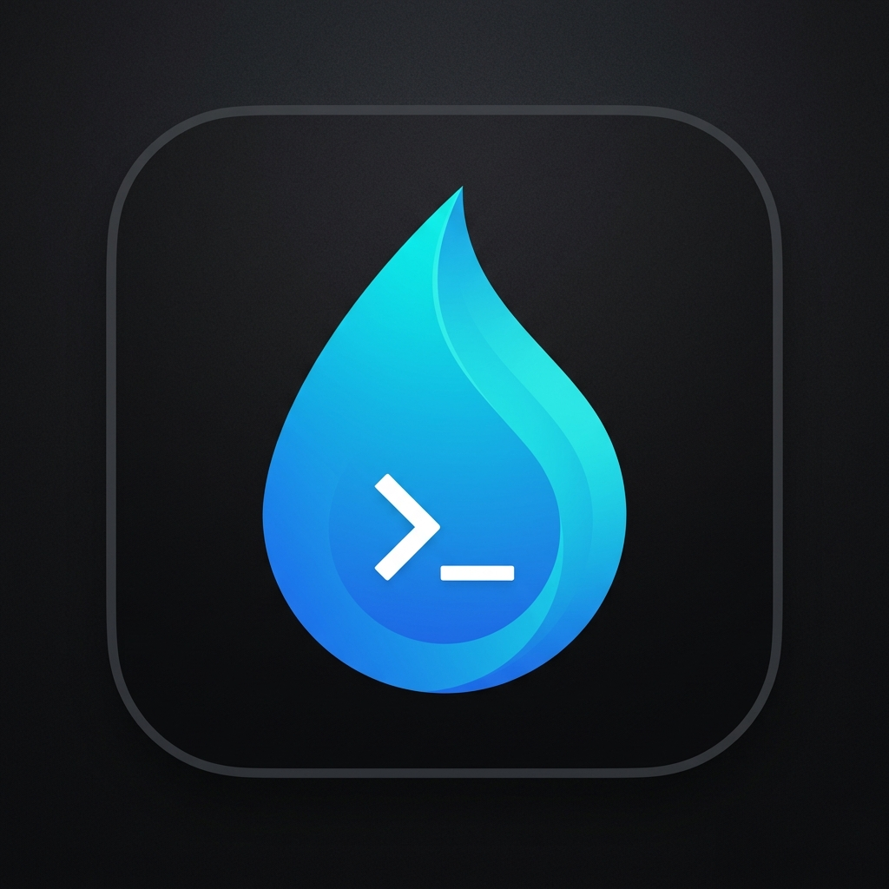

<div align="center">
  
  <h1>shui · 水</h1>
  <p><strong>Shell UI for Zsh. 水 — fluid by design.</strong></p>
  <p>
    
    
    
  </p>
</div>

---

**shui** = Shell UI. 水 = water in Chinese — fluid, effortless, takes the shape of its container.

Most Zsh scripts scatter raw `echo -e "\033[32m..."` calls everywhere. shui gives you a proper design system instead — semantic components, a token-based theme engine, and a single consistent API.

One file to source. No dependencies. Pure Zsh.

> Examples below use `SHUI_ICONS=emoji` — works everywhere without a Nerd Font.
> Swap to `SHUI_ICONS=nerd` for richer glyphs if you have one installed.

---

## Table of contents

- [Installation](#installation)
  - [Manually](#manually)
  - [Submodule](#as-a-project-submodule-recommended-for-scripts)
  - [Antidote](#antidote)
  - [Zinit](#zinit)
  - [Oh My Zsh](#oh-my-zsh)
  - [Zplug](#zplug)
- [Quick start](#quick-start)
- [Usage](#usage)
  - [Importing in your project](#importing-in-your-project)
  - [Components](#components)
    - [Messages](#messages)
    - [Text](#text)
    - [Layout](#layout)
    - [Screen](#screen)
    - [Badge](#badge)
    - [Pill](#pill)
    - [Box](#box)
    - [Table](#table)
    - [Progress](#progress)
    - [Spinner](#spinner)
    - [Interactive](#interactive)
- [Themes](#themes)
  - [Built-in themes](#built-in-themes)
  - [Selecting a theme](#selecting-a-theme)
  - [NO_COLOR](#no_color)
  - [Custom themes](#custom-themes)
  - [Token reference](#token-reference)
- [Icons](#icons)
  - [Icon sets](#icon-sets)
  - [Selecting an icon set](#selecting-an-icon-set)
- [Demo](#demo)
- [Development](#development)
  - [Task runner](#task-runner)
  - [Tests](#tests)
  - [Syntax check](#syntax-check)
- [Requirements](#requirements)
- [License](#license)

---

## Installation

### Manually

```zsh
git clone https://github.com/kud/shui ~/.shui
```

### As a project submodule (recommended for scripts)

```zsh
git submodule add https://github.com/kud/shui lib/shui
```

### Antidote

Add to your `.zsh_plugins.txt`:

```
kud/shui
```

Then reload:

```zsh
antidote load
```

### Zinit

```zsh
zinit light kud/shui
```

### Oh My Zsh

Clone into your custom plugins directory:

```zsh
git clone https://github.com/kud/shui ${ZSH_CUSTOM:-~/.oh-my-zsh/custom}/plugins/shui
```

Then add `shui` to the `plugins` array in `~/.zshrc`:

```zsh
plugins=(... shui)
```

### Zplug

```zsh
zplug "kud/shui"
```

---

## Quick start

```zsh
source ~/.shui/shui.zsh

shui success "Deployment complete"
shui error   "Build failed"
shui warning "Deprecated flag used"
shui info    "Running in dry-run mode"
```

```console
✅ Deployment complete
❌ Build failed
⚠️ Deprecated flag used
ℹ️ Running in dry-run mode
```

---

## Usage

### Importing in your project

Source shui at the top of any Zsh script:

```zsh
#!/usr/bin/env zsh
source "${0:A:h}/lib/shui/shui.zsh"
```

`${0:A:h}` is the Zsh idiom for the absolute directory of the current script — the path resolves correctly regardless of where you call your script from.

Or use an environment variable for a globally installed shui:

```zsh
# ~/.zshrc
export SHUI_DIR="$HOME/.shui"

# your-script.zsh
source "$SHUI_DIR/shui.zsh"
```

To select a theme before loading:

```zsh
SHUI_THEME=minimal source "$SHUI_DIR/shui.zsh"
```

---

### Components

#### Messages

The four semantic message types. Each prints an icon and coloured text on its own line.

```zsh
shui success "Deployment complete"
shui error   "Build failed: config not found"
shui warning "API key expires in 3 days"
shui info    "Running in dry-run mode"
```

```console
✅ Deployment complete
❌ Build failed: config not found
⚠️ API key expires in 3 days
ℹ️ Running in dry-run mode
```

---

#### Text

Inline text formatting and semantic colour helpers.

```zsh
shui bold      "Bold text"
shui dim       "Dimmed text"
shui italic    "Italic text"
shui underline "Underlined text"

shui text --color=success "Success colour"
shui text --color=muted   "Muted colour"
```

```console
Bold text
Dimmed text
Italic text
Underlined text
Success colour
Muted colour
```

Available colour types: `success` `error` `warning` `info` `primary` `muted` `accent`

---

#### Layout

Structure your script output with sections, headings, and spacing.

```zsh
shui section    "Setup"
shui subtitle   "Installing packages"
shui subsection "npm dependencies"
shui subsection "brew formulae"
shui divider
shui spacer
shui spacer 3
```

```console

Setup

◆ Installing packages
• npm dependencies
• brew formulae
────────────────────────────────────────────────────────────────────────────────
```

---

#### Screen

Renders a section header, runs a command, then prints elapsed time. Returns the command's exit code.

```zsh
shui screen "Building" -- npm run build

shui screen "Running tests" -- zsh tests/test-components.zsh
```

```console

Building

✅ Build complete
⏱ 3s

Running tests
...
⏱ 1m 12s
```

```zsh
shui screen <title> -- <command> [args…]
```

---

#### Badge

Solid background inline label. Writes to stdout **without a newline** — use inside `$(...)`.

```zsh
echo "Version: $(shui badge success v2.0)"
echo "Build:   $(shui badge error FAIL)  $(shui badge success PASS)  $(shui badge muted SKIP)"
```

```console
Version:  v2.0
Build:    FAIL    PASS    SKIP
```

```zsh
shui badge <type> <text>
```

Available types: `success` `error` `warning` `info` `primary` `muted`

---

#### Pill

Rounded-edge inline tag. Writes to stdout **without a newline** — use inside `$(...)`.

```zsh
echo "Status: $(shui pill warning beta)"
echo "$(shui pill success stable)  $(shui pill muted deprecated)"
```

```console
Status:  beta
 stable   deprecated
```

```zsh
shui pill <type> <text>
shui pill 135 "custom"   # any 256-colour code (0–255)
```

Available types: `success` `error` `warning` `info` `primary` `muted` `accent` or any `0–255` colour code

---

#### Box

Bordered content block with an optional title. Inline components work inside content.

```zsh
shui box "Simple content inside a box"
shui box --title="Summary" "3 installed\n1 skipped\n0 errors"
shui box --title="Status" "$(shui badge success OK) All systems nominal"
```

```console
┌────────────────────────────────────────────┐
│  Simple content inside a box               │
└────────────────────────────────────────────┘

┌──────────────── Summary ───────────────────┐
│  3 installed                               │
│  1 skipped                                 │
│  0 errors                                  │
└────────────────────────────────────────────┘
```

---

#### Table

Pipe-separated (`|`) rows by default. First argument is the header. Column widths adjust automatically. Use `--sep` to change the delimiter.

```zsh
shui table \
  "Package|Version|Status" \
  "node|20.11.0|$(shui badge success OK)" \
  "bun|1.1.3|$(shui badge success OK)" \
  "python|3.12.0|$(shui badge warning outdated)"
```

```console
┌─────────┬──────────┬──────────┐
│ Package │ Version  │ Status   │
├─────────┼──────────┼──────────┤
│ node    │ 20.11.0  │  OK      │
│ bun     │ 1.1.3    │  OK      │
│ python  │ 3.12.0   │  outdated│
└─────────┴──────────┴──────────┘
```

---

#### Progress

Adds a newline by default. Use `--inline` for loop-based updates.

```zsh
shui progress 50 100
shui progress 50 100 --width=30 --label="Downloading "

# loop use
for i in {1..100}; do
  shui progress $i 100 --inline
  sleep 0.05
done
echo
```

```console
████████████████████░░░░░░░░░░░░░░░░░░░░ 50%
Downloading ██████████░░░░░░░░░░░░░░░░░░░░ 50%
```

**iTerm2 Dock/tab badge** — pass `--iterm` (or `--iterm=<state>`) to also update the native macOS progress indicator. No-op in other terminals.

| Flag                         | iTerm2 state             |
| ---------------------------- | ------------------------ |
| `--iterm` / `--iterm=normal` | Normal (blue)            |
| `--iterm=success`            | Success (green)          |
| `--iterm=warning`            | Warning (yellow)         |
| `--iterm=error`              | Error (red)              |
| `--iterm=indeterminate`      | Spinning (no percentage) |
| `--iterm=clear`              | Dismiss the indicator    |

```zsh
for i in $(seq 0 5 100); do
  shui progress $i 100 --label="Downloading " --iterm --inline
  sleep 0.05
done
shui progress 0 100 --iterm=clear --inline
echo
```

---

#### Spinner

Runs a command in the background with a spinner. Exits with the command's exit code.

In iTerm2, automatically emits an indeterminate badge while running, switches to success or error on completion, then clears.

```zsh
shui spinner "Installing…" -- brew install ripgrep

shui spinner \
  --success="Installed!" \
  --fail="Installation failed" \
  "Installing…" -- npm install
```

```console
⠹ Installing brew packages...
✅ Installed!
```

---

#### Interactive

Prompt the user for confirmation, a selection, or free-form input.

```zsh
# Confirm — exits 0 for yes, 1 for no
shui confirm "Deploy to production?"
shui confirm --default=y "Continue?"

# Select — prints the chosen option to stdout
choice=$(shui select "Pick a profile:" work personal staging)

# Input — prints the entered value to stdout
name=$(shui input "Your name:")
name=$(shui input --default="world" "Your name:")
```

```console
ℹ️  Deploy to production? [y/N]

ℹ️  Pick a profile:
  1) work
  2) personal
  3) staging
→

ℹ️  Your name: (world)
```

---

## Themes

### Built-in themes

| Theme     | Description                                  |
| --------- | -------------------------------------------- |
| `default` | 256-colour with automatic 16-colour fallback |
| `minimal` | Clean 16-colour ANSI palette                 |
| `plain`   | No colour — text and ASCII icons only        |

---

### Selecting a theme

```zsh
SHUI_THEME=minimal source shui.zsh
```

Or export it from your shell profile so all scripts pick it up automatically:

```zsh
export SHUI_THEME=minimal
```

---

### NO_COLOR

shui respects the [NO_COLOR](https://no-color.org/) convention. When `$NO_COLOR` is set, inline components (`badge`, `pill`) fall back to ASCII representations and no colour codes are emitted.

---

### Custom themes

Generate a new theme pre-filled with all tokens:

```zsh
shui theme create mytheme
# → src/themes/mytheme.zsh
```

A custom theme sources `default.zsh` first — only override the tokens you want to change:

```zsh
# src/themes/mytheme.zsh
source "${SHUI_DIR}/src/themes/default.zsh"

SHUI_COLOR_PRIMARY=$(_shui_color "38;5;135" "0;35")  # purple
SHUI_COLOR_ACCENT=$(_shui_color  "38;5;135" "0;35")
```

Load it:

```zsh
SHUI_THEME=mytheme source shui.zsh
```

Manage themes:

```zsh
shui theme list       # list available themes
shui theme validate   # check all required tokens are defined
```

---

### Token reference

| Token                                                                                                                 | Purpose                  |
| --------------------------------------------------------------------------------------------------------------------- | ------------------------ |
| `SHUI_RESET`                                                                                                          | Reset all styles         |
| `SHUI_BOLD` `SHUI_DIM` `SHUI_ITALIC` `SHUI_UNDERLINE`                                                                 | Text styles              |
| `SHUI_COLOR_PRIMARY`                                                                                                  | Primary accent colour    |
| `SHUI_COLOR_SUCCESS`                                                                                                  | Success colour           |
| `SHUI_COLOR_WARNING`                                                                                                  | Warning colour           |
| `SHUI_COLOR_ERROR`                                                                                                    | Error colour             |
| `SHUI_COLOR_INFO`                                                                                                     | Info colour              |
| `SHUI_COLOR_MUTED`                                                                                                    | Secondary / dim text     |
| `SHUI_COLOR_ACCENT`                                                                                                   | Highlight accent         |
| `SHUI_BG_SUCCESS` `SHUI_BG_WARNING` `SHUI_BG_ERROR` `SHUI_BG_INFO` `SHUI_BG_PRIMARY` `SHUI_BG_MUTED`                  | Badge background colours |
| `SHUI_ICON_SUCCESS` `SHUI_ICON_ERROR` `SHUI_ICON_WARNING` `SHUI_ICON_INFO`                                            | Status icons             |
| `SHUI_ICON_BULLET` `SHUI_ICON_ARROW` `SHUI_ICON_CHECK` `SHUI_ICON_CROSS`                                              | UI icons                 |
| `SHUI_ICON_ROBOT` `SHUI_ICON_APPLE` `SHUI_ICON_GIT` `SHUI_ICON_FOLDER` `SHUI_ICON_LINK` `SHUI_ICON_CLOUD`             | Infrastructure icons     |
| `SHUI_ICON_NODE` `SHUI_ICON_PYTHON` `SHUI_ICON_RUBY` `SHUI_ICON_RUST` `SHUI_ICON_GO` `SHUI_ICON_GEM` `SHUI_ICON_BREW` | Language & tool icons    |

---

## Icons

### Icon sets

| Set     | Requires                                | Description                     |
| ------- | --------------------------------------- | ------------------------------- |
| `nerd`  | [Nerd Font](https://www.nerdfonts.com/) | Rich glyphicons _(default)_     |
| `emoji` | Nothing                                 | Unicode emoji, works everywhere |
| `none`  | Nothing                                 | No icons — text only            |

### Selecting an icon set

```zsh
SHUI_ICONS=emoji source shui.zsh   # emoji
SHUI_ICONS=nerd  source shui.zsh   # nerd font (default)
SHUI_ICONS=none  source shui.zsh   # no icons
```

Combine freely with any theme:

```zsh
SHUI_THEME=minimal SHUI_ICONS=emoji source shui.zsh
SHUI_THEME=plain   SHUI_ICONS=none   source shui.zsh   # fully plain
```

---

## Demo

```zsh
zsh demo.zsh
zsh demo.zsh --interactive   # includes confirm, select, and input
```

---

## Development

### Task runner

Tasks are managed with [mise](https://mise.jdx.dev/):

```zsh
mise run test   # run all test suites
mise run lint   # syntax-check all Zsh source files
mise run demo   # run the visual component demo
```

### Tests

The test suite lives in `tests/` and uses a lightweight Zsh harness with inline ✓/✗ output per assertion.

```zsh
mise run test

# or run a single suite directly
zsh tests/test-components.zsh
zsh tests/test-feat-close-api-gap.zsh
```

The shared harness (`tests/_harness.zsh`) provides `assert_eq`, `assert_contains`, `assert_not_contains`, `assert_exit_ok`, and `strip_ansi`. Both suites source it.

### Syntax check

```zsh
mise run lint
# equivalent to:
zsh -n shui.zsh && zsh -n src/**/*.zsh
```

---

## Requirements

- Zsh 5.0+
- A [Nerd Font](https://www.nerdfonts.com/) for the `default` and `minimal` themes — or use `SHUI_ICONS=emoji` or `SHUI_ICONS=none`

---

## License

MIT
